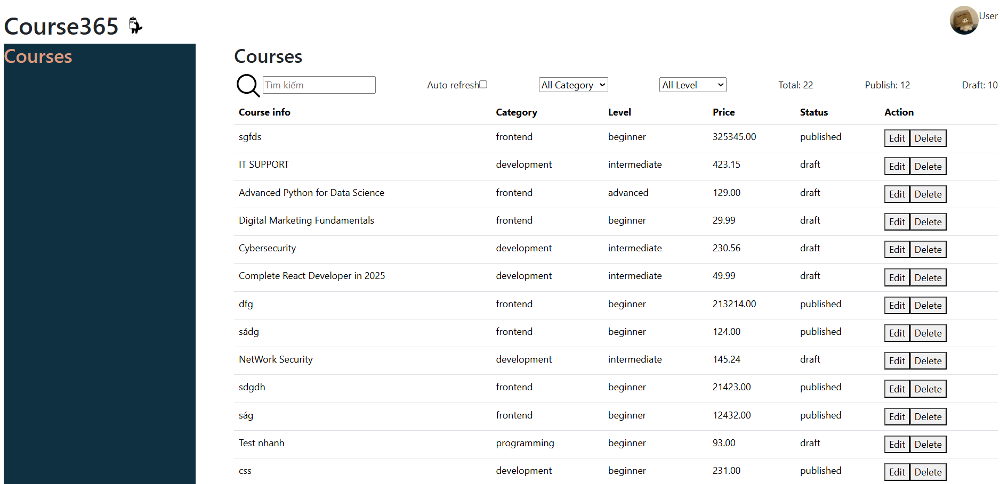
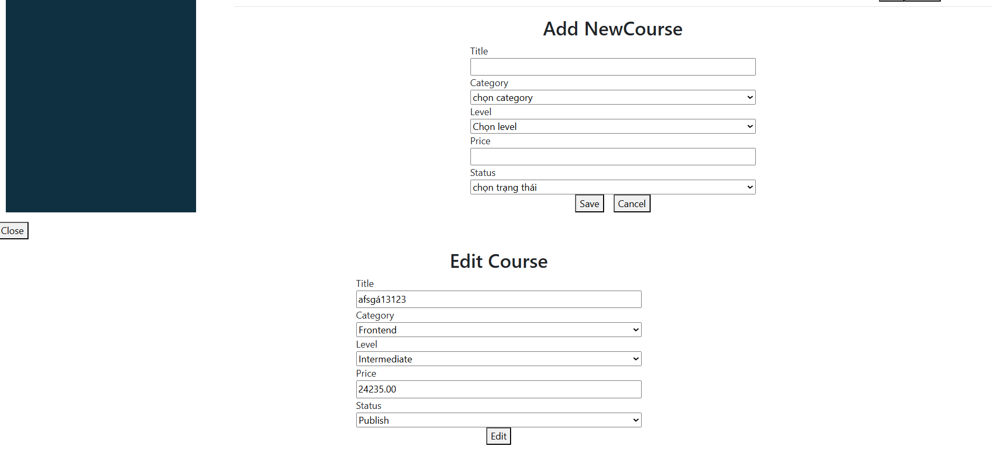

# Course365 v1.0 – Course Management Dashboard
dashboard quản lý khoá học có các tính năng : CRUD, search/filter, UI theo Design

## Features
- Content.jsx
- Header.jsx
- Sidebar.jsx
- CourseCard.jsx
- CourseList.jsx
- CourseListPage.jsx
- CourseFormCreate.jsx
- CourseFormEdit.jsx
- DashboardLayout.jsx
## Tech stack
-  [React](https://react.dev/) - UI library
- [Fetch api](https://course365-api.onschoolbootcamp.edu.vn/courses) link fetch khoá học

## Run locally
- npm run dev
- npm run build